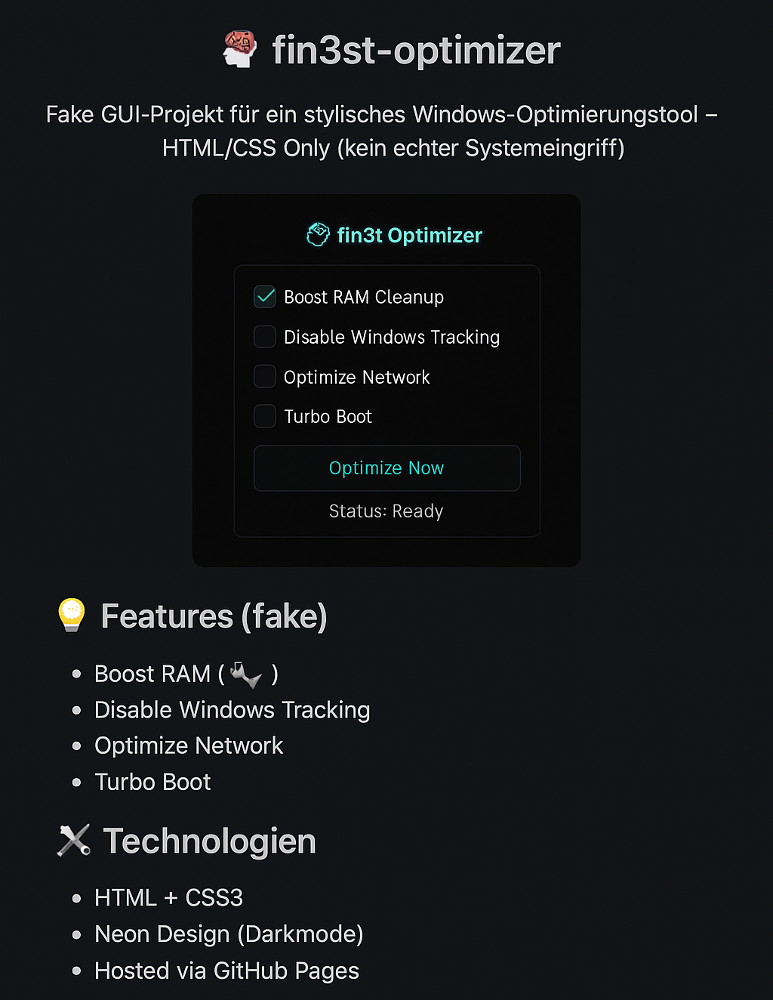

# 🧠 fin3st-optimizer

Fake GUI-Projekt für ein stylisches Windows-Optimierungstool – HTML/CSS Only (kein echter Systemeingriff)

## 💡 Features (fake)

- Boost RAM (🔧)
- Disable Windows Tracking
- Optimize Network
- Turbo Boot

## 🔧 Technologien

- HTML + CSS3
- Neon Design (Darkmode)
- Hosted via GitHub Pages

## 🔗 Live Preview

➡️ (optional) [https://xfin3st.github.io/fin3st-optimizer/](https://xfin3st.github.io/fin3st-optimizer/)

---
